# Database Schema

The following diagram shows the database schema for the application. The schema is designed to store the information of the users, patients, doctors, hospitals, appointments, treatments, medical tests, and other entities related to the medical field.

```mermaid
erDiagram
    User {
        String id
        String email
        Boolean emailVerified
        String name
        String image
        Role role
        String bio
        DateTime createdAt
        DateTime updatedAt
    }
    Session {
        String id
        DateTime expiresAt
        String ipAddress
        String userAgent
        String userId
        String token
        DateTime createdAt
        DateTime updatedAt
    }
    Account {
        String id
        String accountId
        String providerId
        String userId
        String accessToken
        String refreshToken
        String idToken
        DateTime expiresAt
        String password
        DateTime accessTokenExpiresAt
        DateTime refreshTokenExpiresAt
        String scope
        DateTime createdAt
        DateTime updatedAt
    }
    Verification {
        String id
        String identifier
        String value
        DateTime expiresAt
        DateTime createdAt
        DateTime updatedAt
    }
    Patient {
        String id
        Json demographic
        Json biometric
        String userId
        DateTime createdAt
        DateTime updatedAt
    }
    Allergy {
        String id
        String name
        String description
        AllergySeverity severity
        String reaction
        DateTime diagnosticDate
        String patientId
    }
    ChronicDisease {
        String id
        ChronicDiseaseType type
        String description
        DateTime diagnosticDate
        String actualState
        String patientId
    }
    PatientContact {
        String id
        String name
        String phone
        String relationship
        String patientId
    }
    Vaccine {
        String id
        String name
        Int dose
        DateTime date
        String notes
        DateTime nextDose
        String patientId
    }
    Surgery {
        String id
        DateTime date
        String type
        String details
        String surgeon
        String hospital
        String patientId
    }
    Treatment {
        String id
        String description
        TreatmentType type
        TreatmentStatus status
        DateTime startDate
        DateTime endDate
        String patientId
        String doctorId
        String appointmentId
    }
    Medication {
        String id
        String name
        String dose
        String frequency
        String presentation
        String treatmentId
    }
    Therapy {
        String id
        String description
        String treatmentId
    }
    Procedure {
        String id
        String description
        String treatmentId
    }
    MedicalTest {
        String id
        MedicalTestType type
        String laboratory
        DateTime date
        Json attributes
        String patientId
        String doctorId
        String recipeId
        DateTime createdAt
        DateTime updatedAt
    }
    MedicalDocument {
        String id
        DocumentType documentType
        String description
        String url
        String fileName
        String patientId
        String appointmentId
        DateTime createdAt
        DateTime updatedAt
    }
    Hospital {
        String id
        String name
        String adminId
        DateTime createdAt
        DateTime updatedAt
    }
    HospitalAddress {
        String id
        String street
        String city
        String country
        String zipCode
        Json coordinates
        String hospitalId
    }
    Doctor {
        String id
        String licenseMedicalNumber
        Float score
        Int experience
        String userId
        String specialtyId
        DateTime createdAt
        DateTime updatedAt
    }
    Specialty {
        String id
        String name
    }
    ConsultingRoomAddress {
        String id
        String city
        String address
        Json roomCoordinates
        String doctorId
    }
    Schedule {
        String id
        Json[] days
        Int appointmentDuration
        Int maxAppointmentsPerDay
        String doctorId
    }
    Rating {
        String id
        Float score
        String comment
        String doctorId
        String patientId
        DateTime createdAt
        DateTime updatedAt
    }
    Education {
        String id
        String title
        String institution
        DateTime graduatedAt
        String doctorId
    }
    SearchDoctor {
        String id
        String name
        String userId
        String specialty
        Decimal score
        Int experience
        String doctorId
    }
    SearchSchedule {
        String id
        String day
        Int appointments
        Int availabilities
        String searchDoctorId
    }
    SearchDay {
        String id
        String day
        Int hours
        String searchDoctorId
    }
    Price {
        String id
        String name
        Decimal amount
        String currency
        Decimal duration
        String doctorId
        String typeId
    }
    Diagnostic {
        String id
        String description
        DiagnosticStatus status
        DiagnosticType type
        String patientId
        String doctorId
        String appointmentId
        String pathologyId
        DateTime createdAt
        DateTime updatedAt
    }
    Pathology {
        String id
        String name
    }
    Message {
        String id
        String text
        String userId
        String appointmentId
        DateTime createdAt
    }
    Appointment {
        String id
        DateTime date
        String day
        String hour
        String motive
        AppointmentStatus status
        String patientId
        String doctorId
        String typeId
        String specialtyId
        String priceId
        DateTime createdAt
        DateTime updatedAt
    }
    AppointmentType {
        String id
        String name
        String color
        DateTime createdAt
        DateTime updatedAt
    }
    AppointmentRoom {
        String id
        String token
        String url
        String appointmentId
    }
    AppointmentRating {
        String id
        Int rating
        String comment
        String appointmentId
    }
    AppointmentTelemetry {
        String id
        Float weight
        Float temperature
        Float heartRate
        Float bloodPressure
        Float imc
        Float respiratoryRate
        Float oxygenSaturation
        String appointmentId
    }
    AppointmentRecipe {
        String id
        DateTime date
        String description
        String appointmentId
    }
    MedicalReference {
        String id
        String reason
        String observations
        String referencedId
    }
    AppointmentNote {
        String id
        DateTime date
        String description
        String appointmentId
    }
    Symptom {
        String id
        String name
    }
    Order {
        String id
        String description
        OrderType type
        OrderStatus status
        String appointmentId
        String patientId
        DateTime createdAt
        DateTime updatedAt
    }
    Test {
        String id
        String name
    }

    User ||--o{ Session : "has"
    User ||--o{ Account : "has"
    User ||--o{ Patient : "has"
    User ||--o{ Doctor : "has"
    User ||--o{ Hospital : "administers"
    Patient ||--o{ Allergy : "has"
    Patient ||--o{ ChronicDisease : "has"
    Patient ||--o{ PatientContact : "has"
    Patient ||--o{ Vaccine : "has"
    Patient ||--o{ Surgery : "has"
    Patient ||--o{ Treatment : "receives"
    Patient ||--o{ MedicalTest : "undergoes"
    Patient ||--o{ MedicalDocument : "has"
    Patient ||--o{ Rating : "receives"
    Patient ||--o{ Appointment : "has"
    Patient ||--o{ Order : "has"
    Doctor ||--o{ Treatment : "performs"
    Doctor ||--o{ MedicalTest : "orders"
    Doctor ||--o{ Rating : "receives"
    Doctor ||--o{ Appointment : "has"
    Doctor ||--o{ MedicalReference : "receives"
    Doctor ||--o{ Education : "has"
    Doctor ||--o{ SearchDoctor : "is"
    Doctor ||--o{ Price : "sets"
    Doctor ||--o{ Hospital : "works at"
    Specialty ||--o{ Doctor : "specializes"
    Specialty ||--o{ Appointment : "is for"
    Specialty ||--o{ AppointmentType : "is for"
    Appointment ||--o{ Symptom : "has"
    Appointment ||--o{ Diagnostic : "results in"
    Appointment ||--o{ MedicalDocument : "produces"
    Appointment ||--o{ Treatment : "results in"
    Appointment ||--o{ Order : "results in"
    Appointment ||--o{ AppointmentRoom : "has"
    Appointment ||--o{ AppointmentRating : "has"
    Appointment ||--o{ AppointmentTelemetry : "has"
    Appointment ||--o{ AppointmentRecipe : "has"
    Appointment ||--o{ AppointmentNote : "has"
    AppointmentType ||--o{ Price : "has"
    Diagnostic ||--o{ Symptom : "has"
    Diagnostic ||--o{ Pathology : "is"
    Pathology ||--o{ Diagnostic : "has"
    SearchDoctor ||--o{ SearchSchedule : "has"
    SearchDoctor ||--o{ SearchDay : "has"
    Price ||--o{ Appointment : "sets"
    Order ||--o{ Test : "orders"

```

