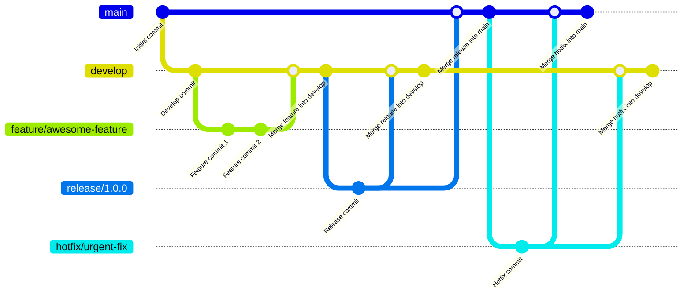

# Gitflow Diagram

This diagram shows the gitflow workflow with the following branches:

```mermaid
gitGraph
    commit id: "Initial commit"
    branch develop
    commit id: "Develop commit"
    branch feature/awesome-feature
    commit id: "Feature commit 1"
    commit id: "Feature commit 2"
    checkout develop
    merge feature/awesome-feature
    commit id: "Merge feature into develop"
    branch release/1.0.0
    commit id: "Release commit"
    checkout develop
    merge release/1.0.0
    commit id: "Merge release into develop"
    checkout main
    merge release/1.0.0
    commit id: "Merge release into main"
    branch hotfix/urgent-fix
    commit id: "Hotfix commit"
    checkout main
    merge hotfix/urgent-fix
    commit id: "Merge hotfix into main"
    checkout develop
    merge hotfix/urgent-fix
    commit id: "Merge hotfix into develop"
```
