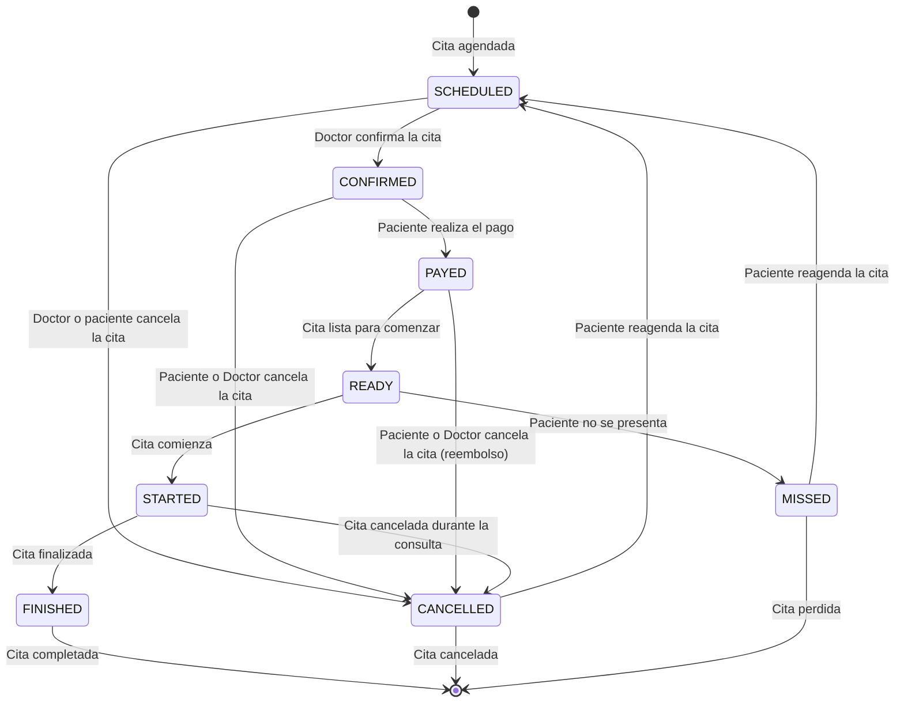

# Diagrama de ciclo de vida

El siguiente diagrama muestra el ciclo de vida de una cita médica en el sistema. El ciclo de vida comienza con la creación de una cita agendada y termina con la finalización de la cita. En el diagrama se muestran los estados por los que puede pasar una cita y las transiciones entre estos estados.

