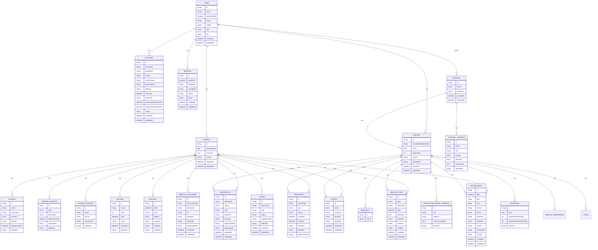

```mermaid
---
config:
  look: handDrown
  theme: default
---
erDiagram
  USER ||--o{ ACCOUNT : "has"
  USER ||--o{ SESSION : "has"
  USER ||--o{ HOSPITAL : "admin"
  USER ||--o{ PATIENT : "has"
  USER ||--o{ DOCTOR : "has"
  USER {
    string id
    string email
    boolean emailVerified
    string name
    string image
    enum role
    string bio
    datetime createdAt
    datetime updatedAt
  }

  SESSION {
    string id
    datetime expiresAt
    string ipAddress
    string userAgent
    string userId
    string token
    datetime createdAt
    datetime updatedAt
  }

  ACCOUNT {
    string id
    string accountId
    string providerId
    string userId
    string accessToken
    string refreshToken
    string idToken
    datetime expiresAt
    string password
    datetime accessTokenExpiresAt
    datetime refreshTokenExpiresAt
    string scope
    datetime createdAt
    datetime updatedAt
  }

  PATIENT ||--o{ ALLERGY : "has"
  PATIENT ||--o{ CHRONIC_DISEASE : "has"
  PATIENT ||--o{ PATIENT_CONTACT : "has"
  PATIENT ||--o{ VACCINE : "has"
  PATIENT ||--o{ SURGERY : "has"
  PATIENT ||--o{ DIAGNOSTIC : "has"
  PATIENT ||--o{ TREATMENT : "has"
  PATIENT ||--o{ MEDICAL_TEST : "has"
  PATIENT ||--o{ MEDICAL_DOCUMENT : "has"
  PATIENT ||--o{ RATING : "has"
  PATIENT ||--o{ APPOINTMENT : "has"
  PATIENT ||--o{ ORDER : "has"
  PATIENT {
    string id
    json demographic
    json biometric
    string userId
    datetime createdAt
    datetime updatedAt
  }

  ALLERGY {
    string id
    string name
    string description
    enum severity
    string reaction
    datetime diagnosticDate
    string patientId
  }

  CHRONIC_DISEASE {
    string id
    enum type
    string description
    datetime diagnosticDate
    string actualState
    string patientId
  }

  PATIENT_CONTACT {
    string id
    string name
    string phone
    string relationship
    string patientId
  }

  VACCINE {
    string id
    string name
    int dose
    datetime date
    string notes
    datetime nextDose
    string patientId
  }

  SURGERY {
    string id
    datetime date
    string type
    string details
    string surgeon
    string hospital
    string patientId
  }

  DOCTOR ||--o{ SPECIALTY : "has"
  DOCTOR ||--o{ CONSULTING_ROOM_ADDRESS : "has"
  DOCTOR ||--o{ SCHEDULE : "has"
  DOCTOR ||--o{ RATING : "has"
  DOCTOR ||--o{ DIAGNOSTIC : "has"
  DOCTOR ||--o{ TREATMENT : "has"
  DOCTOR ||--o{ APPOINTMENT : "has"
  DOCTOR ||--o{ MEDICAL_TEST : "has"
  DOCTOR ||--o{ MEDICAL_REFERENCE : "has"
  DOCTOR ||--o{ PRICE : "has"
  DOCTOR {
    string id
    string licenseMedicalNumber
    float score
    int experience
    string userId
    string specialtyId
    datetime createdAt
    datetime updatedAt
  }

  SPECIALTY {
    string id
    string name
  }

  CONSULTING_ROOM_ADDRESS {
    string id
    string city
    string address
    json roomCoordinates
    string doctorId
  }

  SCHEDULE {
    string id
    json days
    int appointmentDuration
    int maxAppointmentsPerDay
    string doctorId
  }

  RATING {
    string id
    float score
    string comment
    string doctorId
    string patientId
    datetime createdAt
    datetime updatedAt
  }

  DIAGNOSTIC {
    string id
    string description
    enum status
    enum type
    string patientId
    string doctorId
    string appointmentId
    string pathologyId
    datetime createdAt
    datetime updatedAt
  }

  TREATMENT {
    string id
    string description
    enum type
    enum status
    datetime startDate
    datetime endDate
    string patientId
    string doctorId
    string appointmentId
  }

  MEDICAL_TEST {
    string id
    enum type
    string laboratory
    datetime date
    json attributes
    string patientId
    string doctorId
    string recipeId
    datetime createdAt
    datetime updatedAt
  }

  MEDICAL_DOCUMENT {
    string id
    enum documentType
    string description
    string url
    string fileName
    string patientId
    string appointmentId
    datetime createdAt
    datetime updatedAt
  }

  APPOINTMENT {
    string id
    datetime date
    string day
    string hour
    string motive
    enum status
    string patientId
    string doctorId
    string typeId
    string specialtyId
    string priceId
    datetime createdAt
    datetime updatedAt
  }

  ORDER {
    string id
    string description
    enum type
    enum status
    string appointmentId
    string patientId
    datetime createdAt
    datetime updatedAt
  }

  HOSPITAL ||--o{ HOSPITAL_ADDRESS : "has"
  HOSPITAL ||--o{ DOCTOR : "has"
  HOSPITAL {
    string id
    string name
    string adminId
    datetime createdAt
    datetime updatedAt
  }

  HOSPITAL_ADDRESS {
    string id
    string street
    string city
    string country
    string zipCode
    json coordinates
    string hospitalId
  }

```
