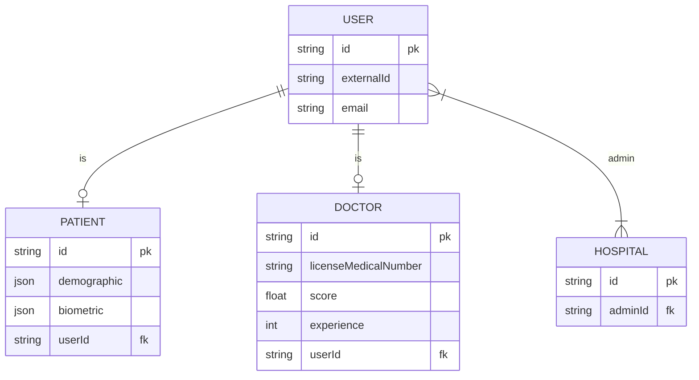

```mermaid
erDiagram
  USER {
    string id pk
    string externalId
    string email

  }
  USER ||--o| PATIENT : is
  USER ||--o| DOCTOR : is
  USER }|--|{ HOSPITAL : admin
  PATIENT {
    string id pk
    json demographic
    json biometric
    string userId fk
  }
  DOCTOR {
    string id pk
    string licenseMedicalNumber
    float score
    int experience
    string userId fk
  }
  HOSPITAL {
    string id pk
    string adminId fk
  }
  
```