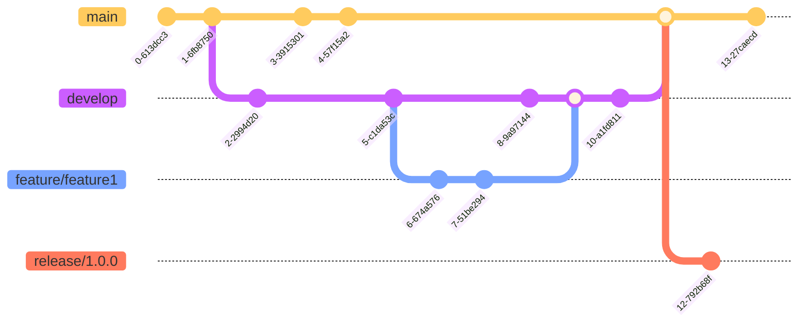

```mermaid
---
config:
  look: classic
  theme: base
---
gitGraph:
  commit
  commit
  branch develop
  checkout develop
  commit
  checkout main
  commit
  commit
  checkout develop
  commit
  branch feature/feature1
  commit
  commit
  checkout develop
  commit
  merge feature/feature1
  commit
  checkout main
  merge develop
  branch release/1.0.0
  commit
  checkout main
  commit
```
